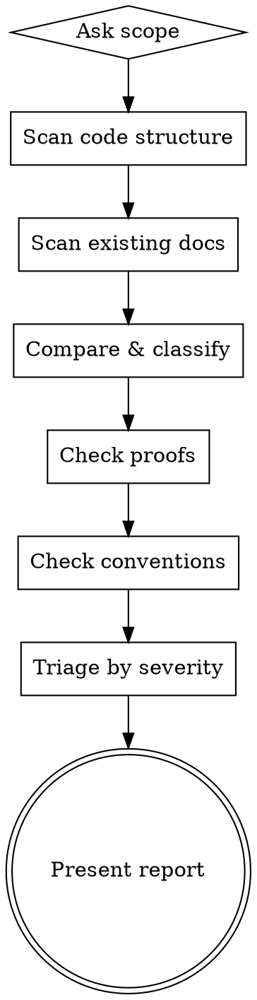

# Doc Audit

## Overview

Read-only diagnostic that compares documented intent against actual code. Produces a prioritized audit report — never auto-fixes. The human decides whether to update docs or change code.

**Announce at start:** "Running doc audit — comparing code against docs to surface drift, gaps, and inconsistencies."

## When to Use

- After a development sprint (has code drifted from docs?)
- Before onboarding a contributor (are docs trustworthy?)
- Periodically (monthly hygiene)
- After major refactors (did docs follow?)
- When you suspect a documented guarantee no longer holds
- When naming feels inconsistent across modules

**Not for:** Writing docs (use `doc-writer`), creating proofs (use `doc-prover`), one-shot code smells (use `surface-tech-debt`).

## Process



## Phase 1: Scope

Ask the user:

> What should I audit?
> 1. Full codebase
> 2. Specific directory (e.g., `src/data/golden/`)
> 3. Specific module or feature
> 4. Proofs only (re-verify all assertions)

For large codebases, recommend starting with a subsystem to avoid context overflow.

**Non-interactive mode:** If running via subagent or automated pipeline, scope must be passed as a parameter (e.g., the directory path). Skip the scope question and proceed directly to Phase 2.

## Phase 2: Scan

### Code structure scan
- List all modules/packages (directories with `__init__.py` or significant `.py`/`.js` files)
- For each module: list public classes, functions, constants
- Note file sizes (LOC) — flag >300 LOC files per project conventions
- Note imports to understand cross-module dependencies

### Docs structure scan
- Read `docs/modules/INDEX.md` if it exists
- Read all files in `docs/modules/`
- Read all files in `docs/proofs/`
- Read `docs/CONVENTIONS.md` if it exists
- Read `docs/adr/` for feature-level decisions
- Note `Last verified` and `Code hash` staleness markers in each doc

## Phase 3: Compare & Classify

For each module found in code, classify its documentation state:

### Finding Types

| Type | Tag | Meaning |
|------|-----|---------|
| **Undocumented** | `GAP` | Code exists, no docs at all |
| **Stale docs** | `STALE` | Doc exists but code has changed (hash mismatch or visible drift) |
| **Code drift** | `DRIFT` | Code has deviated from documented intent (doc describes X, code does Y) |
| **Missing rationale** | `WHY?` | Code exists, docs describe what but not why |
| **Orphaned docs** | `ORPHAN` | Doc exists but code was removed/renamed |
| **Convention violation** | `CONVENTION` | Code violates a rule in CONVENTIONS.md |
| **Naming conflict** | `NAMING` | Same concept, different names across modules |
| **Duplicate logic** | `DUPLICATE` | Same thing implemented differently in multiple places |
| **Invalidated proof** | `PROOF!` | An ASSERTION's cited code lines have changed |
| **Missing assertion** | `ASSERT?` | Complex invariant with no formal ASSERTION |

### How to detect each type

**GAP:** Module directory exists in code, no corresponding `docs/modules/<name>.md`.

**STALE:** Doc has `Code hash: <sha>` header. Compare against `git log --format=%h -1 -- <module_path>`. If different, doc is stale.

**DRIFT:** Read the doc's description of what the module does. Read the module's actual public API. If they describe different behavior, it's drift. Pay special attention to:
- Function signatures that changed
- New public functions not mentioned in docs
- Removed functions still mentioned in docs
- Changed return types or error behavior
- **ADR specification drift** — compare code against ADR-documented formulas, algorithms, and contracts. If an ADR says "standard Brier score" but code implements a variant, that's DRIFT.

**WHY?:** Doc describes what functions do but never mentions trade-offs, alternatives considered, or design decisions. Check: does the doc answer "why this way and not another way?"

**CONVENTION:** Read `docs/CONVENTIONS.md`. Grep for violations. Common ones:
- Naming patterns (`snake_case` vs `camelCase` mixing)
- Error handling patterns (some modules raise, some return None)
- Import conventions (relative vs absolute)
- Data format conventions (dict keys: `snake_case` vs `camelCase`)

**Important:** Check CONVENTIONS.md for an "Intentional Divergences" section before flagging naming conflicts. Some projects intentionally use different conventions across boundaries (e.g., `snake_case` in DB columns but `camelCase` in API responses). If the divergence is documented as intentional, it's NOT a violation.

**NAMING:** Search for semantic duplicates across modules:
- `get_user` vs `fetch_user` vs `retrieve_user`
- `account_id` vs `user_id` vs `accountId` for the same concept
- Different names for the same data structure

**DUPLICATE:** Two modules implementing the same algorithm or pattern differently. Often found via similar function names or similar import patterns.

**PROOF!:** Read each `docs/proofs/*.md`. Extract cited `file:line` references. Check if those lines still contain the cited code. If the code at those lines has changed, the proof may be invalidated.

**ASSERT?:** Look for complex mathematical operations, security boundaries, data invariants that lack a formal ASSERTION. Candidates:
- Normalization/scaling operations
- Cryptographic or hashing operations
- Data validation that enforces invariants
- Permission/access control checks
- Privacy boundaries (data that must not leave the system)

## Phase 4: Triage

Rate each finding:

| Severity | Criteria |
|----------|----------|
| **P0 — Critical** | Invalidated proof, security boundary drift, data invariant broken |
| **P1 — High** | Code drift (doc says X, code does Y), missing rationale for complex logic |
| **P2 — Medium** | Stale docs (hash mismatch but likely minor), naming conflicts, convention violations |
| **P3 — Low** | Undocumented simple modules, orphaned docs, missing assertions for stable code |

## Phase 5: Report

Present findings in this format:

```markdown
# DOC AUDIT REPORT
**Scope:** <what was audited>
**Date:** <date>
**Code hash:** <git short sha of HEAD>

## Summary
| Type | Count | Critical | High | Medium | Low |
|------|-------|----------|------|--------|-----|
| GAP  |       |          |      |        |     |
| STALE|       |          |      |        |     |
| DRIFT|       |          |      |        |     |
| ...  |       |          |      |        |     |

## Critical Findings (P0)
### [PROOF!] <assertion name>
- **Assertion:** <what was claimed>
- **Proof file:** `docs/proofs/<name>.md`
- **Invalidated because:** <file:line> changed from `<old>` to `<new>`
- **Action needed:** Re-verify assertion or update proof

## High Priority (P1)
### [DRIFT] <module name>
- **Doc says:** <documented behavior>
- **Code does:** <actual behavior>
- **Question for human:** Should we update the docs or fix the code?

## Medium Priority (P2)
...

## Low Priority (P3)
...

## Recommended Next Steps
1. <action> — use `doc-prover` to re-verify invalidated proofs
2. <action> — use `doc-writer` to document module X
3. <action> — update CONVENTIONS.md to resolve naming conflict
```

## Integration with Other Skills

- **After audit → `doc-writer`**: "Fix finding #3" → creates/updates module docs
- **After audit → `doc-prover`**: "Re-verify assertion X" → re-checks proof
- **After audit → `surface-tech-debt`**: Audit finds doc gaps; tech-debt finds code smells. Complementary.
- **CONVENTIONS.md** is ground truth for convention checks. If it doesn't exist, `doc-writer` should create it first. **Run `doc-writer` to create CONVENTIONS.md BEFORE running a full audit** — otherwise convention checks have no baseline and produce noise.

## Checklist

- [ ] Asked user for scope
- [ ] Scanned code structure (modules, classes, functions)
- [ ] Scanned existing docs (modules/, proofs/, CONVENTIONS.md, ADRs)
- [ ] Compared code against docs — classified each finding
- [ ] Checked all proof files for invalidated citations
- [ ] Checked for convention violations
- [ ] Triaged by severity (P0-P3)
- [ ] Presented structured report
- [ ] Listed recommended next steps with skill references
