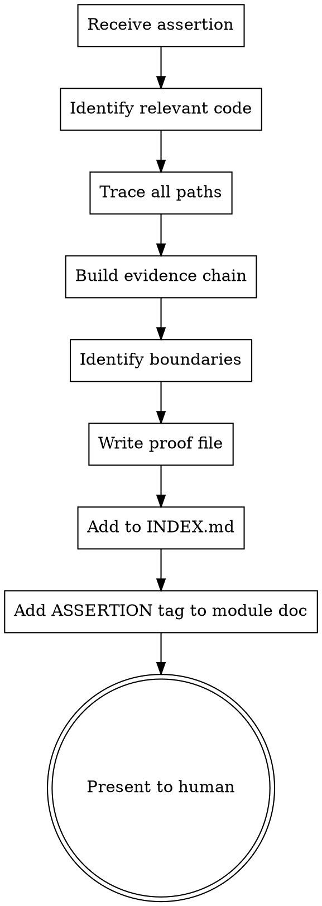

# Doc Prover

## Overview

Creates and maintains formal ASSERTION → PROOF documents. Each proof is a logical argument citing specific `file:line` references that together establish WHY a claimed property holds. Proofs are machine-re-verifiable: if cited code lines change, the proof is flagged as invalidated.

**A proof is a legal brief, not a comment.** It builds a chain of evidence from specific code lines to a conclusion. A reader can verify the assertion by reading ONLY the proof file, without reading the entire codebase.

**Announce at start:** "Using doc-prover to create/verify assertion: <claim>."

## When to Use

- Mathematical property needs a guarantee (normalization, distribution sums, convergence)
- Security boundary needs documenting ("API keys never leave localhost")
- Data privacy guarantee ("uploaded data stays on this machine")
- Data invariant needs verification ("tweet IDs are unique across tables")
- Complex algorithm correctness ("spectral clustering produces k communities")
- `doc-audit` flagged an invalidated proof (`PROOF!`)
- User requests an assertion about system behavior
- Agent notices a complex invariant that should be formally documented

**Not for:** General module docs (use `doc-writer`), drift detection (use `doc-audit`), visual architecture (use `canvas-diagrams`).

## Assertion Categories

| Category | Example | What to prove |
|----------|---------|---------------|
| **Mathematical** | "Betweenness centrality is normalized to [0,1]" | Show the normalization code, prove bounds |
| **Security** | "OPENROUTER_API_KEY is only sent to openrouter.ai" | Trace every use of the key, show no other destination |
| **Privacy** | "Uploaded Twitter archive data never leaves the local machine" | Show all network calls, prove none include archive data |
| **Data invariant** | "Curation splits are deterministic — same tweet always gets same split" | Show the hash function, prove it's pure |
| **Consistency** | "API response format always includes `status` field" | Show all route return statements |
| **Correctness** | "Brier score calculation matches the standard formula" | Show the formula, map to code |

## Proof File Format

Location: `docs/proofs/<assertion-name>.md`

Naming: kebab-case, descriptive. E.g., `split-determinism.md`, `api-key-locality.md`, `betweenness-normalization.md`.

### Template

````markdown
# ASSERTION: <Claim in plain English>

<!--
Status: valid | invalidated | under-review
Created: YYYY-MM-DD
Last verified: YYYY-MM-DD
Code hash: <git short sha at verification time>
Verified by: <human|agent>
-->

## Claim

<Precise statement of what is being asserted. Unambiguous.
Mathematical notation if applicable.>

## Why This Matters

<What breaks or becomes untrustworthy if this assertion is false.
Why someone would want this guarantee.>

## Evidence Chain

### Step 1: <Description of first link in the chain>

**File:** `<relative/path/to/file.py>`
**Lines:** `<start>-<end>`
**Code hash:** `<sha of the file at verification time>`

```python
<exact code at those lines>
```

**Establishes:** <What this code proves, in one sentence.>

### Step 2: <Description of second link>

**File:** `<relative/path/to/another_file.py>`
**Lines:** `<start>-<end>`
**Code hash:** `<sha>`

```python
<exact code>
```

**Establishes:** <What this adds to the proof.>

### Step N: ...

## Logical Chain

<Connect the steps into a deductive argument:>

1. Step 1 shows that <X>.
2. Step 2 shows that <Y>.
3. From X and Y, it follows that <Z>.
4. Therefore, <the assertion holds>.

## Boundary Conditions

<Edge cases, assumptions, and conditions under which
the assertion might NOT hold:>

- **Assumption:** <what must be true for this proof to hold>
- **Exception:** <known case where the assertion is weaker>
- **Threat:** <what code change would invalidate this proof>

## Verification Script (optional)

<If the assertion can be checked programmatically, include
a script or command:>

```bash
python -m scripts.verify_<name>
```

## Related

- Module doc: [`docs/modules/<name>.md`](../modules/<name>.md)
- ADR: `docs/adr/NNN-<name>.md` (if applicable)
- Other proofs that depend on this one: [list]
````

## Process

### Creating a New Proof



1. **Receive assertion** — from user request, `doc-audit` finding, or agent observation
2. **Identify relevant code** — find ALL code paths that touch the claimed property
3. **Trace all paths** — for security/privacy proofs, trace every network call, every file write, every data flow. For mathematical proofs, trace the computation from input to output.
4. **Build evidence chain** — cite specific `file:line` with exact code snippets. Each step should establish one fact.
5. **Identify boundaries** — under what assumptions does this hold? What would break it?
6. **Write proof file** — using template above
7. **Update INDEX.md** — add to Active ASSERTIONs table
8. **Add ASSERTION tag** — in the relevant `docs/modules/<name>.md`:
   ```
   - **ASSERTION: <claim>** → [`docs/proofs/<name>.md`](../proofs/<name>.md)
   ```

### Re-Verifying a Proof

When `doc-audit` flags a `PROOF!` finding, or on periodic review:

1. **Read the proof file**
2. **For each evidence step:**
   - Read the cited `file:line`
   - Compare against the quoted code in the proof
   - If code changed: flag the step as invalidated
3. **If any step invalidated:**
   - Can the proof be repaired? (code changed but property still holds)
   - Or is the assertion now false? (code change broke the invariant)
4. **Update proof status** in the HTML comment header
5. **Report to human:**
   > "Proof `split-determinism` step 3 invalidated: `schema.py:110-116` changed. The hash function was modified from SHA256 to SHA512. The assertion still holds (determinism is preserved) but the proof needs updating."

### Machine-Verifiable Citations

Each evidence step stores:

| Field | Purpose | How to check |
|-------|---------|-------------|
| `File` | Which file | Does the file still exist? |
| `Lines` | Which lines | Read those lines |
| `Code hash` | File state at proof time | `git log --format=%h -1 -- <file>` |
| Code snippet | Exact code quoted | Compare against current file content |

**Quick re-verification** (without reading full proof):
```bash
# For each cited file, check if it changed since proof was written
git diff <proof_code_hash>..HEAD -- <cited_file>
```

If `git diff` is empty, the citation is still valid. If not, the step needs re-examination.

## Writing Good Proofs

### DO

- **Cite exact lines** — not "somewhere in server.py" but `server.py:360-362`
- **Quote the code** — the reader should not need to open the file
- **One fact per step** — each step in the evidence chain establishes exactly one thing
- **State assumptions explicitly** — "this assumes the user has not modified the source code"
- **Include negative evidence** — "grep for `OPENROUTER_API_KEY` finds 3 occurrences, all in this file"
- **Trace exhaustively for security/privacy** — every network call, every file write, every subprocess

### DON'T

- **Don't hand-wave** — "the code probably doesn't send data elsewhere" is not a proof
- **Don't cite just one path** — if there are 5 places the key is used, cite all 5
- **Don't skip edge cases** — "in debug mode, the key is logged to stdout" invalidates a key-locality proof
- **Don't assume imports** — trace what imported modules do with the data
- **Don't prove more than claimed** — the proof should be tight around the assertion

### Proof Quality Levels

| Level | Standard | When to use |
|-------|----------|-------------|
| **Sketch** | High-level argument, key citations | Low-stakes, stable code |
| **Standard** | Full evidence chain, all paths cited | Default for most assertions |
| **Rigorous** | Exhaustive search, negative evidence, boundary analysis | Security, privacy, financial correctness |

The user should specify which level they want. Default to **Standard**.

## Common Assertion Patterns

### "Function F always returns values in range [a, b]"

1. Find the function definition
2. Trace all return paths
3. For each path, show the computation is bounded
4. Check: can inputs cause overflow/underflow?
5. Check: are there early returns that bypass normalization?

### "Data D never leaves the local machine"

1. Find all reads of data D
2. For each read, trace where the data flows
3. Check: is it passed to any network call? Any subprocess? Any file outside the project?
4. Check: is it logged? (logs might be shipped)
5. Check: is it cached in a way that another process could read?
6. Negative evidence: grep for the data identifier across all network-calling code

### "Algorithm A produces correct output for all valid inputs"

1. State the mathematical specification
2. Map specification to code (variable by variable)
3. Show code implements each step of the specification
4. Check edge cases: empty input, single element, maximum size
5. Reference tests that exercise boundary cases

### "Configuration C is never exposed to untrusted parties"

1. Find all reads of configuration C
2. Trace each read to its consumers
3. Check: API responses, log statements, error messages, debug output
4. Check: is it passed to third-party libraries that might log it?
5. Check: is it stored in browser-accessible locations (localStorage, cookies)?

## Checklist

- [ ] Assertion stated precisely and unambiguously
- [ ] All relevant code paths identified (not just the happy path)
- [ ] Each evidence step cites exact `file:line` with code snippet
- [ ] Code hashes recorded for each cited file
- [ ] Logical chain connects steps to conclusion
- [ ] Boundary conditions and assumptions documented
- [ ] Threats identified (what would invalidate this proof)
- [ ] Proof file written to `docs/proofs/<name>.md`
- [ ] INDEX.md updated with new assertion
- [ ] ASSERTION tag added to relevant module doc
- [ ] Presented to human for review
- [ ] For security/privacy: exhaustive search performed (grep for all occurrences)
