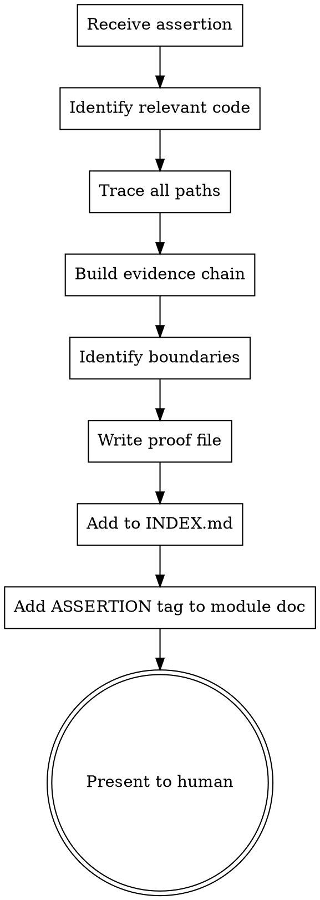

# Doc Prover

## Overview

Creates and maintains formal ASSERTION → PROOF documents. Each proof has two layers: a **human narrative** that builds understanding through explanation, and a **machine manifest** that enables automated re-verification when code changes.

**A proof is a legal brief, not a comment.** It builds a chain of evidence from specific code lines to a conclusion. A reader can verify the assertion by reading ONLY the proof file, without reading the entire codebase.

**Two audiences, one file:** The human reads the narrative top-down to understand *why* the property holds. The agent reads the manifest bottom-up to check *whether* the cited code has changed.

**Announce at start:** "Using doc-prover to create/verify assertion: <claim>."

## When to Use

- Mathematical property needs a guarantee (normalization, distribution sums, convergence)
- Security boundary needs documenting ("API keys never leave localhost")
- Data privacy guarantee ("uploaded data stays on this machine")
- Data invariant needs verification ("tweet IDs are unique across tables")
- Complex algorithm correctness ("spectral clustering produces k communities")
- `doc-audit` flagged an invalidated proof (`PROOF!`)
- User requests an assertion about system behavior
- Agent notices a complex invariant that should be formally documented

**Not for:** General module docs (use `doc-writer`), drift detection (use `doc-audit`), visual architecture (use `canvas-diagrams`).

## Assertion Categories

| Category | Example | What to prove |
|----------|---------|---------------|
| **Mathematical** | "Betweenness centrality is normalized to [0,1]" | Show the normalization code, prove bounds |
| **Security** | "OPENROUTER_API_KEY is only sent to openrouter.ai" | Trace every use of the key, show no other destination |
| **Privacy** | "Uploaded Twitter archive data never leaves the local machine" | Show all network calls, prove none include archive data |
| **Data invariant** | "Curation splits are deterministic — same tweet always gets same split" | Show the hash function, prove it's pure |
| **Consistency** | "API response format always includes `status` field" | Show all route return statements |
| **Correctness** | "Brier score calculation matches the standard formula" | Show the formula, map to code |

## Proof File Format

Location: `docs/proofs/<assertion-name>.md`

Naming: kebab-case, descriptive. E.g., `split-determinism.md`, `api-key-locality.md`, `betweenness-normalization.md`.

### Template

Every proof file has two parts: the **Human Proof** (top) and the **Machine Manifest** (bottom). The human proof is what you read. The machine manifest is what the agent checks.

````markdown
# ASSERTION: <Claim in plain English>

<!--
Status: valid | invalidated | under-review
Created: YYYY-MM-DD
Last verified: YYYY-MM-DD
Code hash: <git short sha at verification time>
Verified by: <human|agent>
-->

---
## Part I: Human Proof
---

### Claim

<Precise statement of what is being asserted. Unambiguous.
Mathematical notation if applicable.>

### Why This Matters

<What breaks or becomes untrustworthy if this assertion is false.
Why someone would want this guarantee. Written for a person who
has never seen this codebase.>

### The Argument

<A narrative explanation — like a textbook proof or a well-written
blog post — that walks the reader through WHY this property holds.
Use natural language, build intuition, explain the design.>

<Embed code snippets inline where they help understanding, but
don't just dump code. Explain what each piece does and how it
connects to the next.>

<Structure as a story with a beginning (setup), middle (the key
mechanism), and end (why this guarantees the property).>

**Example narrative style:**

> The system assigns every tweet to exactly one of three splits
> (train/dev/test) using a deterministic hash. The key insight is
> that the split depends ONLY on the tweet ID — no randomness, no
> database state, no ordering. Here's how:
>
> The function `split_for_tweet()` in `schema.py` takes a tweet ID,
> computes its SHA256 hash, extracts the first 8 hex digits as an
> integer, and takes modulo 100. This gives a bucket 0-99:
>
> ```python
> bucket = int(hashlib.sha256(tweet_id.encode("utf-8")).hexdigest()[:8], 16) % 100
> ```
>
> Buckets 0-69 → train (70%), 70-84 → dev (15%), 85-99 → test (15%).
>
> Because SHA256 is a pure function with no external state, the same
> tweet ID always produces the same bucket, and therefore the same
> split. This holds across runs, across machines, across time.

### Boundary Conditions

<Edge cases, assumptions, and conditions under which
the assertion might NOT hold. Written conversationally:>

- **Assumption:** <what must be true for this proof to hold>
- **Exception:** <known case where the assertion is weaker>
- **Threat:** <what code change would invalidate this proof>
- **What would break this:** <specific scenario>

### Verification (for the skeptical reader)

<How a human can verify this themselves. Could be:>
- A command to run
- A manual test to perform
- A specific file to read
- A query to execute

```bash
# Example: verify two runs produce identical splits
python -c "from src.data.golden.schema import split_for_tweet; print(split_for_tweet('12345'))"
# Run again — same result every time
```

### Related

- Module doc: [`docs/modules/<name>.md`](../modules/<name>.md)
- ADR: `docs/adr/NNN-<name>.md` (if applicable)
- Other proofs that depend on this one: [list]

---
## Part II: Machine Manifest
---

<This section is for automated re-verification by the agent.
Humans can skip this. The agent uses it to check whether cited
code has changed since the proof was written.>

### Citations

| # | File | Lines | Code hash | Status |
|---|------|-------|-----------|--------|
| 1 | `<relative/path/to/file.py>` | `<start>-<end>` | `<sha>` | valid |
| 2 | `<relative/path/to/another.py>` | `<start>-<end>` | `<sha>` | valid |

### Cited Code Snapshots

#### Citation 1: `<file.py>:<start>-<end>`

```python
<exact code at those lines at verification time>
```

**Establishes:** <one-sentence fact>

#### Citation 2: `<another.py>:<start>-<end>`

```python
<exact code>
```

**Establishes:** <one-sentence fact>

### Logical Chain (formal)

1. Citation 1 establishes that <X>.
2. Citation 2 establishes that <Y>.
3. From X and Y, it follows that <Z>.
4. Therefore, <the assertion holds>.

### Re-verification Commands

```bash
# Quick check: have any cited files changed?
git diff <proof_code_hash>..HEAD -- <file1> <file2> ...

# If diff is empty → all citations still valid
# If diff is non-empty → re-examine affected citations
```
````

## Process

### Creating a New Proof



1. **Receive assertion** — from user request, `doc-audit` finding, or agent observation
2. **Identify relevant code** — find ALL code paths that touch the claimed property
3. **Trace all paths** — for security/privacy proofs, trace every network call, every file write, every data flow. For mathematical proofs, trace the computation from input to output.
4. **Build evidence chain** — cite specific `file:line` with exact code snippets. Each step should establish one fact.
5. **Identify boundaries** — under what assumptions does this hold? What would break it?
6. **Write proof file** — using template above
7. **Update INDEX.md** — add to Active ASSERTIONs table
8. **Add ASSERTION tag** — in the relevant `docs/modules/<name>.md`:
   ```
   - **ASSERTION: <claim>** → [`docs/proofs/<name>.md`](../proofs/<name>.md)
   ```

### Re-Verifying a Proof

When `doc-audit` flags a `PROOF!` finding, or on periodic review:

1. **Read Part II (Machine Manifest)** — skip the human narrative
2. **For each citation in the table:**
   - Run `git diff <proof_code_hash>..HEAD -- <cited_file>`
   - If diff is empty: citation still valid, mark `valid`
   - If diff is non-empty: read the cited lines, compare against snapshot
3. **If any citation invalidated:**
   - Read Part I (Human Proof) to understand the argument
   - Can the proof be repaired? (code changed but property still holds)
   - Or is the assertion now false? (code change broke the invariant)
4. **Update proof:**
   - Update citation status in the table (`valid` → `invalidated`)
   - Update header status (`valid` → `invalidated` or `under-review`)
   - If repairable: update both the narrative AND the manifest
5. **Report to human:**
   > "Proof `split-determinism` citation 3 invalidated: `schema.py:110-116` changed. The hash function was modified from SHA256 to SHA512. The assertion still holds (determinism is preserved) but the proof needs updating."

### Two Layers of Verification

| Layer | Who reads it | What it answers | Where in file |
|-------|-------------|-----------------|---------------|
| **Human Proof** (Part I) | Humans, new contributors | "WHY does this property hold?" | Top of file |
| **Machine Manifest** (Part II) | Agent, `doc-audit` | "HAS the cited code changed?" | Bottom of file |

**Agent re-verification workflow** (fast path):
```bash
# Check all cited files at once using the manifest table
git diff <proof_code_hash>..HEAD -- <file1> <file2> <file3>
# Empty output → proof still valid, no further reading needed
```

**Human verification workflow** (understanding path):
1. Read Part I narrative top-to-bottom
2. Follow the argument, check it makes sense
3. Optionally run the verification command in "Verification (for the skeptical reader)"
4. If something feels wrong, check Part II citations against current code

## Writing Good Proofs

### DO

- **Cite exact lines** — not "somewhere in server.py" but `server.py:360-362`
- **Quote the code** — the reader should not need to open the file
- **One fact per step** — each step in the evidence chain establishes exactly one thing
- **State assumptions explicitly** — "this assumes the user has not modified the source code"
- **Include negative evidence** — "grep for `OPENROUTER_API_KEY` finds 3 occurrences, all in this file"
- **Trace exhaustively for security/privacy** — every network call, every file write, every subprocess

### DON'T

- **Don't hand-wave** — "the code probably doesn't send data elsewhere" is not a proof
- **Don't cite just one path** — if there are 5 places the key is used, cite all 5
- **Don't skip edge cases** — "in debug mode, the key is logged to stdout" invalidates a key-locality proof
- **Don't assume imports** — trace what imported modules do with the data
- **Don't prove more than claimed** — the proof should be tight around the assertion

### Proof Quality Levels

| Level | Standard | When to use |
|-------|----------|-------------|
| **Sketch** | High-level argument, key citations | Low-stakes, stable code |
| **Standard** | Full evidence chain, all paths cited | Default for most assertions |
| **Rigorous** | Exhaustive search, negative evidence, boundary analysis | Security, privacy, financial correctness |

The user should specify which level they want. Default to **Standard**.

## Common Assertion Patterns

### "Function F always returns values in range [a, b]"

1. Find the function definition
2. Trace all return paths
3. For each path, show the computation is bounded
4. Check: can inputs cause overflow/underflow?
5. Check: are there early returns that bypass normalization?

### "Data D never leaves the local machine"

1. Find all reads of data D
2. For each read, trace where the data flows
3. Check: is it passed to any network call? Any subprocess? Any file outside the project?
4. Check: is it logged? (logs might be shipped)
5. Check: is it cached in a way that another process could read?
6. Negative evidence: grep for the data identifier across all network-calling code

### "Algorithm A produces correct output for all valid inputs"

1. State the mathematical specification
2. Map specification to code (variable by variable)
3. Show code implements each step of the specification
4. Check edge cases: empty input, single element, maximum size
5. Reference tests that exercise boundary cases

### "Configuration C is never exposed to untrusted parties"

1. Find all reads of configuration C
2. Trace each read to its consumers
3. Check: API responses, log statements, error messages, debug output
4. Check: is it passed to third-party libraries that might log it?
5. Check: is it stored in browser-accessible locations (localStorage, cookies)?

## Checklist

**Part I — Human Proof:**
- [ ] Assertion stated precisely and unambiguously
- [ ] Narrative explains WHY the property holds (not just THAT it holds)
- [ ] A non-expert can follow the argument without reading the codebase
- [ ] Code snippets embedded where they build understanding
- [ ] Boundary conditions and assumptions stated conversationally
- [ ] Human verification command or manual test provided
- [ ] Threats identified (what would break this)

**Part II — Machine Manifest:**
- [ ] All relevant code paths cited (not just the happy path)
- [ ] Each citation has exact `file:line`, code hash, and code snapshot
- [ ] Citation table is complete with status column
- [ ] Formal logical chain connects citations to conclusion
- [ ] Re-verification `git diff` command provided

**Integration:**
- [ ] Proof file written to `docs/proofs/<name>.md`
- [ ] INDEX.md updated with new assertion
- [ ] ASSERTION tag added to relevant module doc
- [ ] Presented to human for review
- [ ] For security/privacy: exhaustive search performed (grep for all occurrences)
