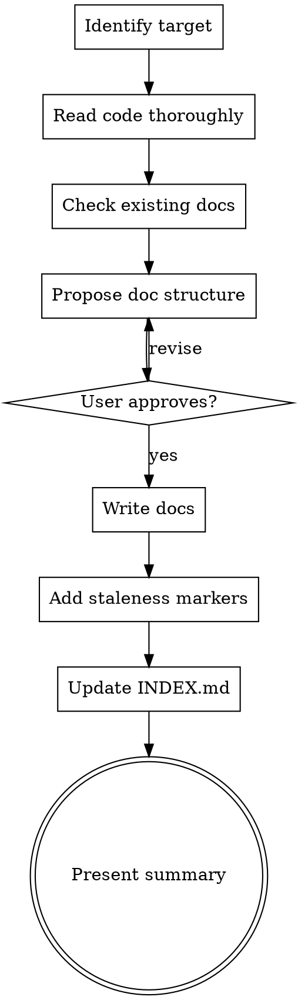

# Doc Writer

## Overview

Creates and updates module documentation at multiple resolution levels. Captures both top-down design rationale (ADR-level) and bottom-up implementation decisions (why the agent/developer chose this approach over alternatives). Maintains `docs/modules/INDEX.md` as the documentation map.

**Docs are flesh. Code is skeleton.** The docs carry context, trade-offs, values, and priorities that the code cannot express.

**Announce at start:** "Using doc-writer to create/update documentation for <target>."

## When to Use

- `doc-audit` found GAP, STALE, DRIFT, or WHY? findings
- New module just created and needs docs
- After making a design decision during coding (capture bottom-up rationale)
- When `docs/CONVENTIONS.md` doesn't exist yet — **create this BEFORE running `doc-audit`** so convention checks have a baseline
- When `docs/modules/INDEX.md` needs updating
- User explicitly asks to document a module or feature

**Not for:** Diagnosing drift (use `doc-audit`), writing proofs (use `doc-prover`), visual architecture (use `canvas-diagrams`).

## Process



## Directory Structure

```
docs/
  modules/
    INDEX.md              # Map of all module docs + active ASSERTIONs
    <module-name>.md      # Per-module documentation
    <module-name>/        # Optional subdirectory for complex modules
      overview.md
      <submodule>.md
  proofs/                 # ASSERTION proof files (managed by doc-prover)
  CONVENTIONS.md          # Project naming, patterns, style ground truth
  adr/                    # Feature-level design decisions (existing)
```

## Document Templates

### Module Doc (`docs/modules/<name>.md`)

```markdown
# <Module Name>

<!--
Last verified: YYYY-MM-DD
Code hash: <git short sha>
Verified by: <human|agent>
-->

## Purpose

<1-3 sentences: what this module does and WHY it exists.
Not what the functions are — why this module is a thing.>

## Design Rationale

### Why this approach?

<What alternatives were considered. What trade-offs drove the choice.
What values/priorities made this the right call.>

### Key decisions

| Decision | Chosen | Alternatives considered | Why |
|----------|--------|------------------------|-----|
| <decision> | <choice> | <options> | <rationale> |

### ADR references

- ADR-NNN: <title> (if feature-level ADR exists)

## Public API

### <function/class name>

**Purpose:** <what it does>
**Signature:** `<signature>`
**Returns:** <return type and meaning>
**Side effects:** <what it changes>
**Invariants:** <what must be true before/after>

## Internal Architecture

<How the module works internally. Data flow within the module.
Key abstractions and why they exist.>

## Dependencies

| Depends on | Why | Import path |
|------------|-----|-------------|
| <module> | <reason> | <import> |

## ASSERTIONs

<List any formal assertions about this module's guarantees.
Each links to a proof file.>

- **ASSERTION: <claim>** → [`docs/proofs/<proof-name>.md`](../proofs/<proof-name>.md)

## Known Limitations

<What this module does NOT do. Boundaries of its responsibility.
Things that look like bugs but are intentional.>

## Tech Debt

<Known shortcuts, band-aids, or things that should be improved.
Cross-reference with ROADMAP.md if applicable.>
```

### CONVENTIONS.md (`docs/CONVENTIONS.md`)

```markdown
# Project Conventions

<!--
Last verified: YYYY-MM-DD
Code hash: <git short sha>
-->

## Naming

| Domain | Convention | Example | Anti-example |
|--------|-----------|---------|-------------|
| Python functions | snake_case | `get_user_by_id` | `getUserById` |
| API response keys | camelCase | `splitCounts` | `split_counts` |
| Database columns | snake_case | `account_id` | `accountId` |
| React components | PascalCase | `ClusterView` | `clusterView` |
| CSS classes | kebab-case | `node-label` | `nodeLabel` |
| Constants | UPPER_SNAKE | `DEFAULT_MODEL` | `defaultModel` |

## Error Handling

| Context | Pattern | Example |
|---------|---------|---------|
| API routes | Return JSON `{"error": "<msg>"}` with HTTP status | `return jsonify({"error": str(exc)}), 400` |
| Store methods | Raise ValueError for bad input | `raise ValueError("axis required")` |
| Scripts | `logger.error()` + `sys.exit(1)` | See `scripts/classify_tweets.py` |

## Data Formats

| Data | Format | Why |
|------|--------|-----|
| Tweet IDs | String (not int) | Twitter IDs exceed JS Number.MAX_SAFE_INTEGER |
| Timestamps | ISO 8601 UTC in DB, display-local in UI | Unambiguous, sortable |
| Probabilities | Dict `{"l1": 0.x, ...}` summing to 1.0 | Validated by `schema.validate_distribution()` |

## File Organization

| Rule | Threshold | Action |
|------|-----------|--------|
| Max file size | ~300 LOC | Split by domain/concern |
| Test files | Mirror source structure | `tests/test_<module>.py` |
| Scripts | `scripts/` directory | Executable, CLI-driven |
| No orphaned root files | — | Ask user where it belongs |

## Patterns

<Architectural patterns used consistently across the codebase.
When a new module is created, it should follow these.>

| Pattern | Where used | Example |
|---------|-----------|---------|
| Blueprint + store | API routes | `golden_bp` + `GoldenStore` |
| Singleton store | DB access | `_golden_store` with lazy init |
| Deterministic hashing | Split assignment | `SHA256(tweet_id) % 100` |

## Intentional Divergences

<Document naming/style divergences that cross boundaries intentionally.
These are NOT convention violations — `doc-audit` should skip them.>

| Divergence | Where | Why |
|------------|-------|-----|
| snake_case in DB, camelCase in API responses | All API routes | Frontend JS convention vs DB convention; conversion in route handlers |
```

### INDEX.md (`docs/modules/INDEX.md`)

```markdown
# Module Documentation Index

<!--
Last updated: YYYY-MM-DD
-->

## Modules

| Module | Doc | Status | Last verified |
|--------|-----|--------|---------------|
| `src/api/routes/golden.py` | [golden](golden.md) | current | 2026-02-27 |
| `src/data/golden/` | [golden-store](golden-store.md) | stale | 2026-02-25 |
| `src/archive/` | — | undocumented | — |

## Active ASSERTIONs

| Assertion | Proof | Status | Module |
|-----------|-------|--------|--------|
| Split assignment is deterministic | [split-determinism](../proofs/split-determinism.md) | valid | golden |
| API keys never leave localhost | [api-key-locality](../proofs/api-key-locality.md) | valid | api |

## Conventions

See [CONVENTIONS.md](../CONVENTIONS.md) for project-wide naming, patterns, and style rules.
```

## Writing Guidelines

### Resolution Levels

Scale detail to complexity:

| Complexity | Doc length | What to include |
|------------|-----------|-----------------|
| Simple utility (< 50 LOC) | 2-3 sentences in parent module doc | Purpose, signature, one-liner rationale |
| Standard module (50-300 LOC) | Half-page module doc | Purpose, rationale, public API, dependencies |
| Complex module (300+ LOC) | Full module doc + subsections | Everything in template, plus internal architecture |
| System/feature level | ADR + module docs + assertions | Full design rationale, trade-off analysis |

### Capturing Bottom-Up Decisions

When the agent makes implementation choices during coding, capture them:

```markdown
### Implementation Notes (bottom-up)

- **Client-side hash filtering** (2026-02-27): Tweet selection uses
  `SHA256(tweet_id) % 100` in Python instead of SQL JOIN with
  `curation_split` table. Reason: JOIN scans 5.5M rows (107s), client-side
  hash takes 4s. Trade-off: slight over-fetch (7x for 15% splits).

- **Single-tweet-per-LLM-call** (2026-02-27): Classify one tweet at a time
  rather than batching 5-10. Reason: simpler parsing, easier resume on
  failure, more reliable. Trade-off: ~2x more API calls.
```

These are distinct from ADR decisions — they're the small choices that accumulate.

### What NOT to Write

- Don't duplicate code in docs (reference `file:line` instead)
- Don't write docs for obvious getters/setters
- Don't document private implementation details unless they're surprising
- Don't write aspirational docs ("this module will eventually...") — capture that in ROADMAP.md
- Don't override existing docs without showing the diff to the human first

### Staleness Markers

Every doc file MUST have this HTML comment header:

```html
<!--
Last verified: YYYY-MM-DD
Code hash: <output of `git log --format=%h -1 -- <module_path>`>
Verified by: <human|agent>
-->
```

`doc-audit` uses these markers to detect stale docs without re-reading everything.

## Updating Existing Docs

When a doc already exists:

1. **Read the existing doc fully**
2. **Diff against current code** — what changed?
3. **Present the diff to the human:**
   > "Module X's doc says `list_candidates` returns sorted results, but the code now uses `NOT EXISTS + LIMIT` which returns unsorted. Should I update the doc to reflect the new behavior, or should the code be fixed?"
4. **Only write after human approves direction**
5. **Update staleness markers**

**Never silently overwrite docs.** The doc may carry intent that the code drifted from — the human decides which is correct.

## Checklist

- [ ] Identified target module(s) to document
- [ ] Read code thoroughly (public API, internal architecture, dependencies)
- [ ] Checked for existing docs, ADRs, assertions
- [ ] Proposed doc structure to human
- [ ] Got human approval before writing
- [ ] Wrote docs using appropriate template
- [ ] Added staleness markers (date, code hash, verified-by)
- [ ] Updated `docs/modules/INDEX.md`
- [ ] Created `docs/CONVENTIONS.md` if it didn't exist
- [ ] Cross-referenced relevant ADRs
- [ ] Captured any bottom-up decisions discovered during writing
- [ ] Did NOT silently overwrite existing documentation
